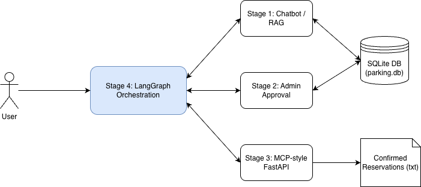
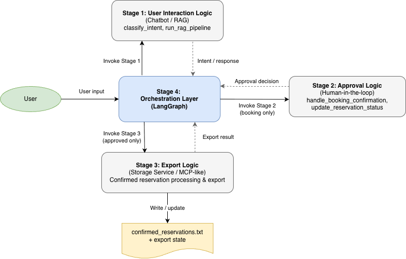

# Smart Parking RAG Assistant

A smart parking chatbot project that combines Retrieval-Augmented Generation (RAG) for information support with an automated booking workflow, human-in-the-loop administrative approval, and a finalized reservation processing service.

## Project Overview
  
This project implements a multi-stage intelligent parking assistant:
- **Stage 1** covers RAG-based information support (answering questions about parking rules, prices, etc.) and collecting all necessary booking details from users.
- **Stage 2** adds a human-in-the-loop reservation approval workflow, featuring a second administrative agent built using LangChain concepts.
- **Stage 3** introduces a lightweight MCP-style processing server that exports confirmed reservations to a persistent text ledger.
- **Stage 4** introduces a unified orchestration layer using **LangGraph** to manage the full lifecycle from initial query to final export.

## Features

- **Informational Queries**: RAG pipeline using Weaviate and LLM to provide accurate answers from a knowledge base.
- **Booking Data Collection**: Automated identification and non-empty validation of user details (name, vehicle plate, time) for reservations.
- **SQLite-based Reservation Storage**: A single unified database for managing users, availability, and reservation records.
- **Reservation Approval Lifecycle**: Support for `pending_admin_approval`, `approved`, and `rejected` statuses.
- **Admin REST API**: A FastAPI-based service for administrators to review and decide on reservation requests.
- **Second LangChain-based Admin Agent**: A dedicated agent using LangChain tools (`@tool`) to process administrative decisions.
- **MCP-style Processing Server**: A FastAPI-based service for downstream processing and persistent storage of approved reservations.
- **LangGraph Orchestration**: A unified, stateful workflow that connects all stages into a single cohesive pipeline.
- **Automated Tests**: A robust test suite using `pytest` covering all four stages, including orchestration, performance, and synchronization.

## Project Structure

- **`parking.db`**: The unified SQLite database file located at the project root.
- **`stage_1/`**: Core RAG pipeline, guardrails, and initial booking logic.
- **`stage_2/`**: Reservation approval workflow and admin integration.
- **`stage_3/`**: Lightweight MCP-style processing server and text ledger storage.
- **`stage_4/`**: LangGraph orchestration layer and end-to-end validation.

## Stage 4: Orchestration (Final Integration)
  
Stage 4 unifies the project using LangGraph:
- **Stateful Workflow**: Manages transitions between user interaction, approval, and recording.
- **Real-world Integration**: Directly invokes logic from Stages 1, 2, and 3.
- **Dynamic Routing**: Handles informational vs. booking paths based on detected intent.
- **Audit Trail**: Ensures every approved booking is securely recorded in the Stage 3 ledger.

## Full Reservation Workflow

1. **User Interaction (Stage 1/4)**: User provides booking fields or asks questions.
2. **Intent Detection (Stage 1/4)**: System identifies if the user wants to book or just needs info.
3. **Admin Submission (Stage 2/4)**: Bookings are created as `pending_admin_approval`.
4. **Admin Decision (Stage 2/4)**: Administrator approves or rejects the request.
5. **Data Export (Stage 3/4)**: Approved reservations are automatically written to `confirmed_reservations.txt`.
6. **Final Response (Stage 4)**: User receives a comprehensive final status message.

## Setup

### 1. Virtual Environment
```bash
python3 -m venv .venv
source .venv/bin/activate
```

### 2. Dependency Installation
```bash
pip install -r smart-parking-rag-assistent/stage_1/requirements.txt
pip install -r smart-parking-rag-assistent/stage_3/requirements.txt
pip install -r smart-parking-rag-assistent/stage_4/requirements.txt
```

### 3. Database Initialization
```bash
python3 smart-parking-rag-assistent/stage_1/scripts/init_db.py
```

## Running the Project

### Full Orchestration Demo (Stage 4)
This is the recommended way to see the full integrated system:
```bash
export PYTHONPATH=$(pwd)/smart-parking-rag-assistent
python3 smart-parking-rag-assistent/stage_4/run_demo.py
```

### End-to-End Validation
```bash
export PYTHONPATH=$(pwd)/smart-parking-rag-assistent
python3 smart-parking-rag-assistent/stage_4/validate_e2e.py
```

## Testing

The project uses **pytest** for automated verification across all stages.

**All tests:**
```bash
export PYTHONPATH=$(pwd)/smart-parking-rag-assistent
python3 -m pytest smart-parking-rag-assistent/stage_1/tests/ \
                 smart-parking-rag-assistent/stage_2/tests/ \
                 smart-parking-rag-assistent/stage_3/tests/ \
                 smart-parking-rag-assistent/stage_4/tests/
```

**Stage 4 specifically:**
```bash
export PYTHONPATH=$(pwd)/smart-parking-rag-assistent
python3 -m pytest smart-parking-rag-assistent/stage_4/tests/
```
