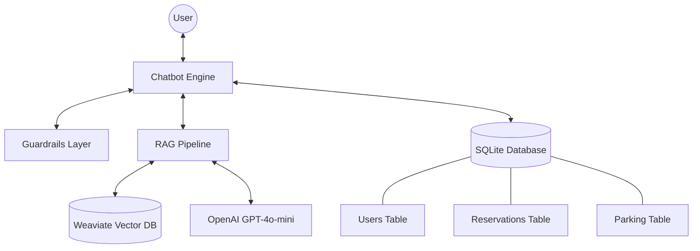

# Module 1: Smart Parking RAG Assistant

This module implements the core RAG (Retrieval-Augmented Generation) pipeline and a terminal-based chatbot for the Smart Parking Assistant.

## Prerequisites

<<<<<<< Updated upstream
- **Python**: 3.9+
- **OpenAI API Key**: Required for GPT-based responses.
- **Docker & Docker Compose**: Required for running the Weaviate vector database.
- **Weaviate**: Vector database instance (started via Docker).
=======
- **RAG Pipeline**: Combines efficient retrieval from a knowledge base with LLM-powered generation to provide accurate answers.
- **Intelligent Booking**: Guided data collection and validation for seamless parking spot reservations.
- **DB Integration**: Reliable storage for user profiles, parking lot data, and reservations using SQLite.
- **Vector Search**: High-performance semantic search through the knowledge base using Weaviate.
- **Guardrails**: Rule-based safety and filtering mechanisms that block sensitive requests and route user queries correctly.

## Project Structure
>>>>>>> Stashed changes

## Environment Variables

Configure the following environment variables. You can create a `.env` file in this directory or export them in your shell.

<<<<<<< Updated upstream
| Variable | Description | Default |
| :--- | :--- | :--- |
| `OPENAI_API_KEY` | Your OpenAI API key | - |
| `DB_NAME` | Path to the SQLite database | `../../parking.db` |
| `WEAVIATE_HOST` | Weaviate connection host | `localhost` |
| `WEAVIATE_PORT` | Weaviate connection port | `8080` |
=======
### 1. Environment Preparation

Create a virtual environment and install dependencies.

**macOS / Linux**
>>>>>>> Stashed changes

### Linux/macOS
```bash
<<<<<<< Updated upstream
export OPENAI_API_KEY="your-api-key"
```

### Windows PowerShell
```powershell
$env:OPENAI_API_KEY="your-api-key"
```
=======
python3 -m venv venv
source venv/bin/activate
pip install -r stage_1/requirements.txt
```

**Windows (PowerShell)**

```powershell
python -m venv venv
venv\Scripts\Activate.ps1
pip install -r stage_1\requirements.txt
```

**Windows (Command Prompt)**

```cmd
python -m venv venv
venv\Scripts\activate.bat
pip install -r stage_1\requirements.txt
```

### 2. Configuration

Copy the environment variables file and configure your OpenAI API key.

**macOS / Linux**
>>>>>>> Stashed changes

## Installation

### Linux/macOS
```bash
python3 -m venv .venv
source .venv/bin/activate
python -m pip install --upgrade pip
pip install -r requirements.txt
```
<<<<<<< Updated upstream

### Windows PowerShell
```powershell
python -m venv .venv
.\.venv\Scripts\Activate.ps1
python -m pip install --upgrade pip
pip install -r requirements.txt
```
=======

**Windows (PowerShell)**

```powershell
Copy-Item stage_1\.env.example stage_1\.env
```

**Windows (Command Prompt)**

```cmd
copy stage_1\.env.example stage_1\.env
```

Edit `stage_1/.env` and provide your `OPENAI_API_KEY`.

### 3. Infrastructure (Weaviate)

The RAG pipeline requires a running Weaviate instance. Ensure Weaviate is running locally (default at `localhost:8080`). You can start it using the provided `docker-compose.yml`.

**macOS / Linux**
>>>>>>> Stashed changes

*Note: If PowerShell execution policy blocks activation, run:*
```powershell
Set-ExecutionPolicy -ExecutionPolicy RemoteSigned -Scope CurrentUser
```

## Linux/macOS Launch

1. **Start Weaviate**:
   ```bash
   docker compose up -d
   ```

2. **Initialize Database and Vector Store**:
   ```bash
   export PYTHONPATH=$PYTHONPATH:$(pwd)/..
   python3 scripts/init_db.py
   python3 scripts/create_collection.py
   python3 scripts/ingest_kb.py
   ```

3. **Start Chatbot**:
   ```bash
   python3 app/chatbot.py
   ```

## Windows PowerShell Launch

1. **Start Weaviate**:
   ```powershell
   docker compose up -d
   ```

2. **Initialize Database and Vector Store**:
   ```powershell
   $env:PYTHONPATH="..;."
   python scripts/init_db.py
   python scripts/create_collection.py
   python scripts/ingest_kb.py
   ```

3. **Start Chatbot**:
   ```powershell
   python app/chatbot.py
   ```

## How to Run Tests

### Linux/macOS
```bash
PYTHONPATH=.. pytest -v
```

<<<<<<< Updated upstream
### Windows PowerShell
```powershell
$env:PYTHONPATH=".."
pytest -v
```

## Troubleshooting (Startup)

- **OpenAI API Key**: Ensure `OPENAI_API_KEY` is set. The bot will fail at startup if missing.
- **Weaviate Connection**: If scripts fail with connection errors, verify Weaviate is running using `docker ps`.
- **Import Errors**: If you encounter `ModuleNotFoundError`, ensure your `PYTHONPATH` includes the parent directory as shown in the launch steps.
- **PowerShell Activation**: Ensure you use `.\.venv\Scripts\Activate.ps1` and have set the correct execution policy.
- **Missing Database**: Ensure `scripts/init_db.py` is run before the chatbot to create `parking.db`.
=======
**Windows**

```powershell
docker compose -f stage_1\docker-compose.yml up -d
```

### 4. Database Setup

Stage 1 uses a shared SQLite database located at the repository root: `parking.db`. This database initializes the base schema which is shared across all project stages.

The following base tables are created:

- `users`: User profiles and contact information.
- `reservations`: Parking booking records.
- `parking`: Static parking lot details and availability.

To initialize the database:

**macOS / Linux**

```bash
python3 -m stage_1.scripts.init_db
```

**Windows**

```powershell
python -m stage_1.scripts.init_db
```

To verify the setup, you can check the created tables.

**macOS / Linux**

```bash
sqlite3 parking.db ".tables"
```

**Windows (if sqlite3 is installed)**

```powershell
sqlite3 parking.db ".tables"
```

### 5. Data Initialization (Weaviate)

Execute the following scripts to set up the vector storage for the RAG pipeline.

**macOS / Linux**

```bash
# 1. Create Weaviate collection
python3 -m stage_1.scripts.create_collection

# 2. Ingest knowledge base into Weaviate
python3 -m stage_1.scripts.ingest_kb
```

**Windows**

```powershell
# 1. Create Weaviate collection
python -m stage_1.scripts.create_collection

# 2. Ingest knowledge base into Weaviate
python -m stage_1.scripts.ingest_kb
```

## Usage

Run the chatbot in console mode.

**macOS / Linux**

```bash
python3 -m stage_1.app.chatbot
```

**Windows**

```powershell
python -m stage_1.app.chatbot
```

### Interaction Examples

- **Information (RAG):** "Where is the parking located?"
- **Booking:** "I want to book a spot"
- **Reservation Status:** "What is the status of my reservation R-20260401-001?"

## Testing

The test suite ensures the reliability of the core components, including guardrails routing, booking logic, database operations, and the overall RAG pipeline behavior.

Run tests using `pytest`.

**macOS / Linux**

```bash
python3 -m pytest stage_1/tests/
```

**Windows**

```powershell
python -m pytest stage_1/tests/
```

## Architecture Overview

- **RAG (Weaviate + LLM):** Handles informational queries by retrieving relevant context and generating natural responses.
- **SQLite:** Manages structured data for bookings, user information, and parking availability.
- **Guardrails:** Ensures system safety and correct routing of user requests based on identified intent.

### System Architecture Diagram


>>>>>>> Stashed changes
