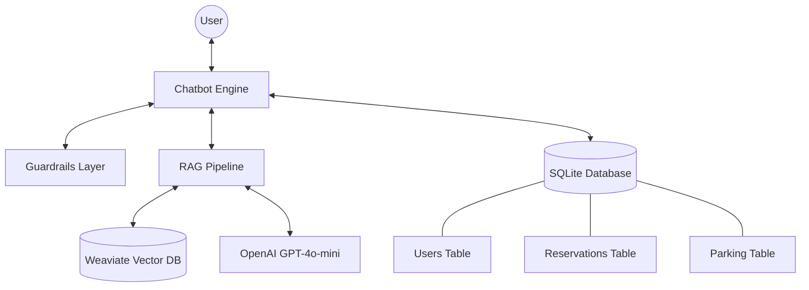

# Smart Parking RAG Assistant

A RAG-based chatbot designed for intelligent parking management and information retrieval. The assistant combines semantic question answering with a booking workflow for reservations and availability checks.

## Key Features

- **RAG Pipeline**: Combines efficient retrieval from a knowledge base with LLM-powered generation to provide accurate answers.
- **Intelligent Booking**: Guided data collection and validation for seamless parking spot reservations.
- **DB Integration**: Reliable storage for user profiles, parking lot data, and reservations using SQLite.
- **Vector Search**: High-performance semantic search through the knowledge base using Weaviate.
- **Guardrails**: Rule-based safety and filtering mechanisms that block sensitive requests and route user queries correctly.
## Project Structure

```text
smart-parking-rag-assistant/
├── stage_1/                # Main development stage
│   ├── app/                # Application logic
│   │   ├── chatbot.py      # Chatbot entry point
│   │   ├── rag_pipeline.py # RAG architecture implementation
│   │   ├── db.py           # SQLite database operations
│   │   ├── embeddings.py   # Vector embedding generation
│   │   ├── guardrails.py   # Intent routing and safety filtering
│   ├── scripts/            # Infrastructure and setup scripts
│   │   ├── init_db.py      # SQLite database initialization
│   │   ├── create_collection.py # Weaviate collection setup
│   │   ├── ingest_kb.py    # Knowledge base ingestion into Weaviate
│   ├── data/               # Project knowledge base and datasets
│   ├── tests/              # Automated test suite
│   ├── docker-compose.yml  # Local infrastructure orchestration
│   ├── .env.example        # Configuration template
│   ├── requirements.txt    # Stage-specific dependencies
│   └── README.md           # Project documentation
```

## Installation and Setup

### 1. Environment Preparation

Create a virtual environment and install dependencies.

**macOS / Linux**

```bash
python3 -m venv venv
source venv/bin/activate
pip install -r stage_1/requirements.txt
```

**Windows (PowerShell)**

```powershell
python -m venv venv
venv\Scripts\Activate.ps1
pip install -r stage_1\requirements.txt
```

**Windows (Command Prompt)**

```cmd
python -m venv venv
venv\Scripts\activate.bat
pip install -r stage_1\requirements.txt
```

### 2. Configuration
Copy the environment variables file and configure your OpenAI API key:

**macOS / Linux**

```bash
cp stage_1/.env.example stage_1/.env
```

**Windows (PowerShell)**

```powershell
Copy-Item stage_1\.env.example stage_1\.env
```

**Windows (Command Prompt)**

```cmd
copy stage_1\.env.example stage_1\.env
```

Edit `stage_1/.env` and provide your `OPENAI_API_KEY`.

### 3. Infrastructure (Weaviate)
The RAG pipeline requires a running Weaviate instance. Ensure Weaviate is running locally (default at `localhost:8080`). You can start it using the provided `docker-compose.yml`:


**macOS / Linux**

```bash
docker-compose -f stage_1/docker-compose.yml up -d
```

**Windows**

```powershell
docker compose -f stage_1\docker-compose.yml up -d
```

### 4. Database Setup
Stage 1 uses a shared SQLite database located at the repository root: `parking.db`. This database initializes the base schema which is shared across all project stages.

The following base tables are created:
- `users`: User profiles and contact information.
- `reservations`: Parking booking records.
- `parking`: Static parking lot details and availability.

**macOS / Linux**

```bash
python3 -m stage_1.scripts.init_db
```

**Windows**

```powershell
python -m stage_1.scripts.init_db
```

To verify the setup, you can check the created tables:

**macOS / Linux**

```bash
sqlite3 parking.db ".tables"
```

**Windows (if sqlite3 is installed)**

```powershell
sqlite3 parking.db ".tables"
```

### 5. Data Initialization (Weaviate)
Execute the following scripts to set up the vector storage for the RAG pipeline:

**macOS / Linux**

```bash
python3 -m stage_1.scripts.create_collection
python3 -m stage_1.scripts.ingest_kb
```

**Windows**

```powershell
python -m stage_1.scripts.create_collection
python -m stage_1.scripts.ingest_kb
```

## Usage

Run the chatbot in console mode:

**macOS / Linux**

```bash
python3 -m stage_1.app.chatbot
```

**Windows**

```powershell
python -m stage_1.app.chatbot
```

### Interaction Examples:
- **Information (RAG):** "Where is the parking located?"
- **Booking:** "I want to book a spot"
- **Reservation Status:** "What is the status of my reservation R-20260401-001?"

## Testing

The test suite ensures the reliability of the core components, including guardrails routing, booking logic, database operations, and the overall RAG pipeline behavior.

Run tests using `pytest`:

**macOS / Linux**

```bash
python3 -m pytest stage_1/tests/
```

**Windows**

```powershell
python -m pytest stage_1/tests/
```
## Architecture Overview

- **RAG (Weaviate + LLM)**: Handles informational queries by retrieving relevant context and generating natural responses.
- **SQLite**: Manages structured data for bookings, user information, and parking availability.
- **Guardrails**: Ensures system safety and correct routing of user requests based on identified intent.

### System Architecture Diagram
