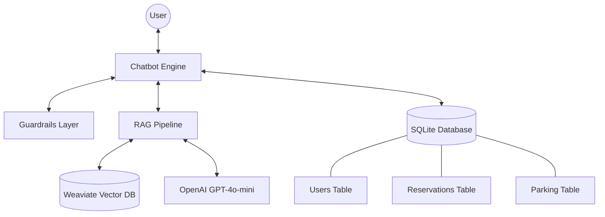

# Smart Parking RAG Assistant

A RAG-based chatbot designed for intelligent parking management and information retrieval. The assistant combines semantic question answering with a booking workflow for reservations and availability checks.

## Key Features

- **RAG Pipeline**: Combines efficient retrieval from a knowledge base with LLM-powered generation to provide accurate answers.
- **Intelligent Booking**: Guided data collection and validation for seamless parking spot reservations.
- **DB Integration**: Reliable storage for user profiles, parking lot data, and reservations using SQLite.
- **Vector Search**: High-performance semantic search through the knowledge base using Weaviate.
- **Guardrails**: Rule-based safety and filtering mechanisms that block sensitive requests and route user queries correctly.
## Project Structure

```text
smart-parking-rag-assistant/
├── stage_1/                # Main development stage
│   ├── app/                # Application logic
│   │   ├── chatbot.py      # Chatbot entry point
│   │   ├── rag_pipeline.py # RAG architecture implementation
│   │   ├── db.py           # SQLite database operations
│   │   ├── embeddings.py   # Vector embedding generation
│   │   ├── guardrails.py   # Intent routing and safety filtering
│   ├── scripts/            # Infrastructure and setup scripts
│   │   ├── init_db.py      # SQLite database initialization
│   │   ├── create_collection.py # Weaviate collection setup
│   │   ├── ingest_kb.py    # Knowledge base ingestion into Weaviate
│   ├── data/               # Project knowledge base and datasets
│   ├── tests/              # Automated test suite
│   ├── docker-compose.yml  # Local infrastructure orchestration
│   ├── .env.example        # Configuration template
│   ├── requirements.txt    # Stage-specific dependencies
│   └── README.md           # Project documentation
```

## Installation and Setup

### 1. Environment Preparation
Create a virtual environment and install dependencies:

```bash
python3 -m venv venv
source venv/bin/activate  # For Windows: venv\Scripts\activate
pip install -r stage_1/requirements.txt
```

### 2. Configuration
Copy the environment variables file and configure your OpenAI API key:

```bash
cp stage_1/.env.example stage_1/.env
```
Edit `stage_1/.env` and provide your `OPENAI_API_KEY`.

### 3. Infrastructure (Weaviate)
The RAG pipeline requires a running Weaviate instance. Ensure Weaviate is running locally (default at `localhost:8080`). You can start it using the provided `docker-compose.yml`:

```bash
docker-compose -f stage_1/docker-compose.yml up -d
```

### 4. Data Initialization
Execute the following scripts in order to set up the databases and vector storage:

```bash
export PYTHONPATH=$PYTHONPATH:$(pwd)/stage_1

# 1. Initialize SQLite database
python3 stage_1/scripts/init_db.py

# 2. Create Weaviate collection
python3 stage_1/scripts/create_collection.py

# 3. Ingest knowledge base into Weaviate
python3 stage_1/scripts/ingest_kb.py
```

## Usage

Run the chatbot in console mode:

```bash
export PYTHONPATH=$PYTHONPATH:$(pwd)/stage_1
python3 stage_1/app/chatbot.py
```

### Interaction Examples:
- **Information (RAG)**: "Where is the parking located?"
- **Booking**: "I want to book a spot"
- **Reservation Status**: "What is the status of my reservation R-20260401-001?"

## Testing

The test suite ensures the reliability of the core components, including guardrails routing, booking logic, database operations, and the overall RAG pipeline behavior.

Run tests using `pytest`:

```bash
pytest stage_1/tests/
```

## Architecture Overview

- **RAG (Weaviate + LLM)**: Handles informational queries by retrieving relevant context and generating natural responses.
- **SQLite**: Manages structured data for bookings, user information, and parking availability.
- **Guardrails**: Ensures system safety and correct routing of user requests based on identified intent.

### System Architecture Diagram
