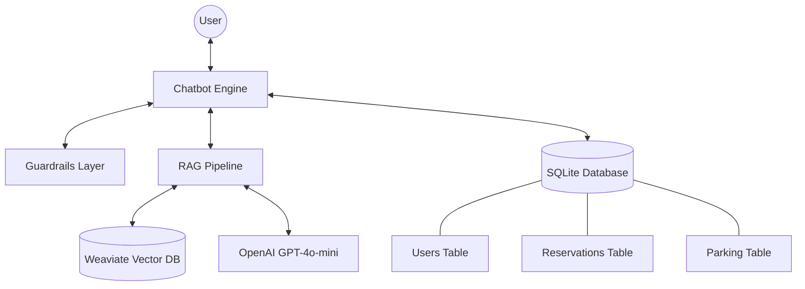

# Smart Parking RAG Assistant

A professional, RAG-powered parking assistant chatbot designed for the Central Plaza Parking facility in Tbilisi, Georgia. This system integrates advanced semantic retrieval with a deterministic SQL-based booking flow and human-in-the-loop validation.

## 1. Project Overview

The Smart Parking RAG Assistant is an intelligent chatbot that helps users navigate parking services, check real-time availability, and book parking spaces. It leverages a Retrieval-Augmented Generation (RAG) pipeline to provide accurate information based on a curated knowledge base while using a relational database for operational tasks.

### Key Features
- **RAG-based QA:** Provides reliable answers about parking rules, pricing, and location using semantic search over a Markdown knowledge base.
- **Deterministic Booking System:** A step-by-step conversational flow for creating parking reservations with field validation.
- **Real-time Availability:** Instant queries for general, EV-specific, and accessible parking slots directly from the SQLite database.
- **Session Memory:** Remembers user details within a session for quick "book again" functionality.
- **Human-in-the-loop Validation:** Reservations are marked as 'pending' for administrator review, ensuring safe capacity management.
- **Guardrails:** Rule-based security layer to prevent sensitive data exposure and handle out-of-scope queries.

## 2. Architecture

The system follows a modular architecture separating static knowledge from dynamic operational data.

### System Architecture Diagram


## 3. Data Design

The system utilizes two distinct storage solutions:
- **Static Data (Weaviate):** Stores the `parking_knowledge_base.md` divided into semantic chunks with embeddings for high-speed retrieval.
- **Dynamic Data (SQLite):** Manages relational data including user profiles, reservation history, and real-time slot availability.

## 4. RAG Pipeline

The RAG pipeline ensures that the assistant's answers are grounded in official documentation:
1. **Ingestion:** Sections from the knowledge base are chunked with overlap and converted into 384-dimensional vectors using the `all-MiniLM-L6-v2` model.
2. **Retrieval:** User queries are embedded and used to perform a `near_vector` search in Weaviate.
3. **Reranking:** A lightweight post-retrieval layer applies keyword boosting and FAQ deprioritization to improve Top-1 accuracy.
4. **Generation:** The top-3 chunks are provided as context to OpenAI's GPT-4o-mini to generate a concise, context-restricted answer.

## 5. Interactive Features

- **Information Retrieval:** "What are the working hours?" or "How much does EV charging cost?"
- **Booking Flow:** Initiated by phrases like "I want to reserve a space". Steps: First Name -> Last Name -> Plate -> Start Time -> End Time -> Confirmation.
- **Session Memory:** User: "Book again with the same car" -> Bot: "Reusing details for Anna Ivanova, plate AA123BB..."
- **Reservation Status:** "Check status of R-20260331-001".

## 6. Guardrails

To ensure safe and predictable behavior, the assistant includes:
- **Context-Restricted Answering:** The LLM is instructed to ignore external knowledge and only use the provided context.
- **Sensitive Request Blocking:** Queries like "show all bookings" are intercepted by a rule-based layer and rejected.
- **Out-of-Scope Handling:** Unrelated topics (weather, hotels) receive a polite redirection to parking services.

## 7. Evaluation

Evaluation performed on a 15-query diverse dataset:

| Metric | Result |
| :--- | :--- |
| **Recall@1** | 0.67 |
| **Recall@3** | 1.00 (with Reranking) |
| **Precision@3** | 0.40 |
| **Avg Latency** | ~310ms |

**Strengths:** Excellent Recall@3 ensures the correct information is almost always in the context.
**Limitations:** Some ranking noise between highly similar sections (e.g., General vs Rules) which is mitigated by the reranker.

## 8. How to Run

1. **Start Infrastructure:**
   ```bash
   docker-compose up -d
   ```
2. **Setup Environment:**
   ```bash
   cp .env.example .env
   # Edit .env with your OPENAI_API_KEY
   ```
3. **Install Dependencies:**
   ```bash
   pip install -r requirements.txt
   ```
4. **Initialize Database:**
   ```bash
   python3 scripts/init_db.py
   ```
5. **Ingest Knowledge Base:**
   ```bash
   python3 scripts/create_collection.py
   python3 scripts/ingest_kb.py
   ```
6. **Run Chatbot:**
   ```bash
   PYTHONPATH=. python3 app/chatbot.py
   ```
7. **Run Evaluation:**
   ```bash
   PYTHONPATH=. python3 scripts/evaluate_retrieval.py
   ```
8. **Run Tests:**
   ```bash
   PYTHONPATH=. python3 -m pytest tests/
   ```

## 9. Project Structure

The project is organized into a clean, modular structure:

- `app/`: Core application logic (Chatbot, RAG, Embeddings, Guardrails, DB service).
- `data/`: Knowledge base (`.md`) and evaluation datasets (`.json`).
- `scripts/`: Initialization, ingestion, and evaluation scripts.
- `tests/`: Comprehensive unit tests with mocks for external dependencies.
- `diagrams/`: Draw.io XML files for architecture and flow diagrams.
- `docs/`: Final README and presentation materials.
- `docker-compose.yml`: Weaviate infrastructure.
- `requirements.txt`: Project dependencies.
- `pytest.ini`: Testing configuration.
